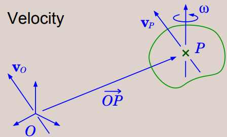
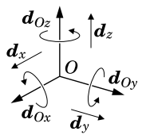
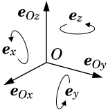
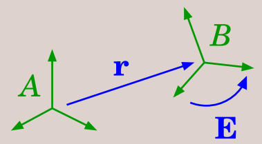
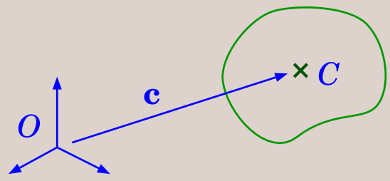
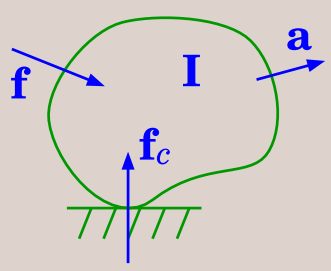

# "Rigid Body Dynamics Algorithms"解説

neka-nat

---

## "Rigid Body Dynamics Algorithms"

* Roy Featherstoneさんによって書かれた剛体力学の本
  * ロボットのような多リンクの剛体の**順動力学・逆動力学アルゴリズム**を紹介
  * 剛体の運動を**Spatial Vector**という6次元のベクトルで表現することで上記アルゴリズムを効率的に解く方法を提案
  * [Bullet](https://github.com/bulletphysics/bullet3), [Dart](https://dartsim.github.io/)などの有名な物理エンジンが採用している剛体力学計算手法

---

http://www.springer.com/la/book/9780387743141

---

## Spatial Vectorについて

* Spatial Vectorでは2つの6次元ベクトル空間を考える

$$
\begin{aligned}
\boldsymbol{M}^6 &- Motion \ vectors \\\\
\boldsymbol{F}^6 &- Force \ vectors
\end{aligned}
$$

* この2つの空間の内積が仕事量となる

$$
\begin{aligned}
\boldsymbol{m} \cdot \boldsymbol{f}=work \\\\
"\cdot" : \boldsymbol{M}^6 \times \boldsymbol{F}^6 \mapsto R
\end{aligned}
$$

---

## Spatial Vectorの基底ベクトル

* Motion Vector $\boldsymbol{m}$ の $\boldsymbol{M}^6$上の基底ベクトルを $ \\{ \boldsymbol{d}_1, ..., \boldsymbol{d}_6 \\} $ とすると
  * 基底ベクトルによるベクトル表現 $ \underline{m} = [m_1, ..., m_6]^T $
  * $ \boldsymbol{m} = \sum_{i=0}^6 m_i \boldsymbol{d}_i $
* Force Vector $\boldsymbol{f}$ の $\boldsymbol{F}^6$上の基底ベクトルを $ \\{ \boldsymbol{e}_1, ..., \boldsymbol{e}_6 \\} $ とすると
  * 基底ベクトルによるベクトル表現 $ \underline{f} = [f_1, ..., f_6]^T $
  * $ \boldsymbol{f} = \sum_{i=0}^6 f_i \boldsymbol{e}_i $

---

## 双対基底

* 任意の$\boldsymbol{M}^6$上の基底ベクトル $ \\{ \boldsymbol{d}_1, ..., \boldsymbol{d}_6 \\} $ に対して，
以下を満足する $\boldsymbol{F}^6$ 上の**双対基底ベクトル** $ \\{ \boldsymbol{e}_1, ..., \boldsymbol{e}_6 \\} $
が存在する

$$
\begin{equation}
\boldsymbol{d}_i \cdot \boldsymbol{d}_j = \left \\{
\begin{array}{l}
0　(i \neq j) \\\\
1　(i=j)
\end{array}
\right.
\end{equation}
$$

* 双対基底によるベクトル表現を用いて内積を表現する

$$
\boldsymbol{m} \cdot \boldsymbol{f} = \underline{m}^T \underline{f}
$$

---

## 速度ベクトル

---

## Spatial Velocity

* 剛体上のとある点Pにおける並進速度$\boldsymbol{v}_P$は以下のように表せる
$$
\boldsymbol{v}_P = \boldsymbol{v}_O + \boldsymbol{\omega} \times \overrightarrow{OP}
$$
  * $\boldsymbol{v}_O$は原点Oでの剛体の並進速度
  * $\boldsymbol{\omega}$は剛体の角速度
* Spatial Velocity
$$
\hat{\boldsymbol{v}}_O = \left[
\begin{array}{c}
\boldsymbol{\omega} \\\\
\boldsymbol{v}_O
\end{array}
\right]
$$

---

## 力ベクトル

---

## Spatial Force

* 剛体上のとある点Pまわりにおけるトルク$\boldsymbol{n}_P$は以下のように表せる
$$
\boldsymbol{n}_P = \boldsymbol{n}_O + \boldsymbol{f} \times \overrightarrow{OP}
$$
  * $\boldsymbol{n}_O$は原点Oまわりでの剛体のトルク
  * $\boldsymbol{f}$は剛体にかかる並進力
* Spatial Force
$$
\hat{\boldsymbol{f}}_O = \left[
\begin{array}{c}
\boldsymbol{n}_O \\\\
\boldsymbol{f}
\end{array}
\right]
$$

---

## Plucker Coordinates

* 直交座標系において12の基底ベクトルを定義する

$$
\\boldsymbol{d}\_{O\_x},
\\boldsymbol{d}\_{O\_y},
\\boldsymbol{d}\_{O\_z},
\\boldsymbol{d}\_x,
\\boldsymbol{d}\_y,
\\boldsymbol{d}\_z
$$

$$
\\boldsymbol{e}\_x,
\\boldsymbol{e}\_y,
\\boldsymbol{e}\_z,
\\boldsymbol{e}\_{O\_x},
\\boldsymbol{e}\_{O\_y},
\\boldsymbol{e}\_{O\_z}
$$

---

## 座標変換

* Motion vectorのA座標からB座標への変換

$$
\begin{eqnarray}
^{B} X_A =\left[
\begin{array}{cc}
\boldsymbol{E} & \boldsymbol{0} \\\\
\boldsymbol{0} & \boldsymbol{E}
\end{array}
\right]
\left[
\begin{array}{cc}
\boldsymbol{1} & \boldsymbol{0} \\\\
-\boldsymbol{r} \times & \boldsymbol{1}
\end{array}
\right]
\end{eqnarray}
$$

---

## 座標変換

* ここで$\boldsymbol{r} \times$は

$$
\begin{eqnarray}
\boldsymbol{r} \times =\left[
\begin{array}{ccc}
0 & -r_z & r_y \\\\
r_z & 0 & -r_x \\\\
-r_y & r_x & 0
\end{array}
\right]
\end{eqnarray}
$$

* Force vectorの変換行列は$\( ^B \boldsymbol{X}_A \)^{-T}$

---

## Spatial Vector基本演算

* 物体Aの速度を$\boldsymbol{v}\_A$，物体Bの速度を$\boldsymbol{v}\_B$，Aから見たBの相対速度を$\boldsymbol{v}\_{BA}$とすると

$$
\boldsymbol{v}\_B = \boldsymbol{v}\_A + \boldsymbol{v}\_{BA}
$$

* 速度変数$\dot{q}$と関節軸ベクトル$\boldsymbol{s}$を用いると，関節角速度$\boldsymbol{v}_J$は

$$
\boldsymbol{v}_J = \boldsymbol{s} \dot{q}
$$

---

## Spatial Vector基本演算

* 同じ物体に力$\boldsymbol{f}_1$，$\boldsymbol{f}_2$がかかっている際に物体にかかる力のトータルは以下で表される

$$
\boldsymbol{f}_{tot} = \boldsymbol{f}_1 + \boldsymbol{f}_2
$$

* 物体Aが物体Bに対して力$\boldsymbol{f}$を作用させている場合，物体Aは物体Bから$-\boldsymbol{f}$の反力を受ける(作用反作用)

---

## 外積計算

* $\hat{\boldsymbol{v}}_O$，$\hat{\boldsymbol{m}}_O$をMotion Vector，$\hat{\boldsymbol{f}}_O$をForce Vectorとすると

$$
\hat{\boldsymbol{v}}_O \times \hat{\boldsymbol{m}}_O =\left[
\begin{array}{c}
\boldsymbol{\omega} \\\\
\boldsymbol{v}_O
\end{array}
\right]
\times
\left[
\begin{array}{c}
\boldsymbol{m} \\\\
\boldsymbol{m}_O
\end{array}
\right]
=
\left[
\begin{array}{c}
\boldsymbol{\omega} \times \boldsymbol{m} \\\\
\boldsymbol{\omega} \times \boldsymbol{m}_O + \boldsymbol{v}_O \times \boldsymbol{m}
\end{array}
\right]
$$

$$
\hat{\boldsymbol{v}}_O \times ^\* \hat{\boldsymbol{f}}_O =\left[
\begin{array}{c}
\boldsymbol{\omega} \\\\
\boldsymbol{v}_O
\end{array}
\right]
\times ^\*
\left[
\begin{array}{c}
\boldsymbol{\tau}_O \\\\
\boldsymbol{f}
\end{array}
\right]
=
\left[
\begin{array}{c}
\boldsymbol{\omega} \times \boldsymbol{\tau}_O + \boldsymbol{v}_O \times \boldsymbol{f} \\\\
\boldsymbol{\omega} \times \boldsymbol{f}
\end{array}
\right]
$$

---

## 微分

* Spatial Vectorの微分

$$
\frac{d \boldsymbol{s}}{dt} = \lim_{\delta \rightarrow 0} \frac{\boldsymbol{s}\( t+\delta t \) - \boldsymbol{s}\( t \)}{\delta t}
$$

* 速度$\boldsymbol{v}$で動いている物体上にある固定点における速度$\boldsymbol{s}$の微分

$$
\frac{d \boldsymbol{s}}{dt} = \boldsymbol{v} \times \boldsymbol{s}
$$

---

## 微分

* 速度$\boldsymbol{v}_A$で動いている座標A上のMotion Vector$\boldsymbol{s}$の微分

$$
^A \Bigl[ \frac{d \boldsymbol{s}}{dt} \Bigr] = \frac{d ^A \boldsymbol{s}}{dt} + ^A \boldsymbol{v}_A \times ^A \boldsymbol{s}
$$

---

## 加速度

$$
\hat{\boldsymbol{a}}_O=
\left[
\begin{array}{c}
\dot{\boldsymbol{\omega}} \\\\
\ddot{\boldsymbol{r}}-\boldsymbol{\omega} \times \dot{\boldsymbol{r}}
\end{array}
\right]
$$

---

## 剛体の慣性

---

## 剛体の慣性

* 点C回りの慣性テンソル

$$
\boldsymbol{I}_C=
\left[
\begin{array}{cc}
\overline{\boldsymbol{I}}_C & \boldsymbol{0} \\\\
\boldsymbol{0} & m \boldsymbol{1}
\end{array}
\right]
$$

* 点O回りの慣性テンソル

$$
\boldsymbol{I}_O=
\left[
\begin{array}{cc}
\boldsymbol{1} & \boldsymbol{c} \times \\\\
\boldsymbol{0} & \boldsymbol{1}
\end{array}
\right]
\boldsymbol{I}_O
\left[
\begin{array}{cc}
\boldsymbol{1} & \boldsymbol{0} \\\\
\boldsymbol{c} \times ^T & \boldsymbol{1}
\end{array}
\right]
=
\left[
\begin{array}{cc}
\overline{\boldsymbol{I}}_C+m \boldsymbol{c} \times \boldsymbol{c} \times ^T & m \boldsymbol{c} \times \\\\
m \boldsymbol{c} \times ^T & m \boldsymbol{1}
\end{array}
\right]
$$

---

## 運動方程式

$$
\boldsymbol{f} = \frac{d}{dt} \( \boldsymbol{Iv} \) =
\boldsymbol{Ia} + \boldsymbol{v} \times ^\* \boldsymbol{Iv}
$$

---

## 拘束あり運動

