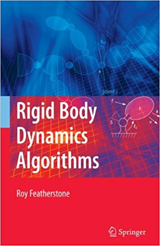

# "Rigid Body Dynamics Algorithms"解説

neka-nat

---

## "Rigid Body Dynamics Algorithms"

* Roy Featherstoneさんによって書かれた剛体力学の本
  * ロボットのような多リンクの剛体の**順動力学・逆動力学アルゴリズム**を紹介
  * 剛体の運動を**Spatial Vector**という6次元のベクトルで表現することで上記アルゴリズムを効率的に解く方法を提案
  * [Bullet](https://github.com/bulletphysics/bullet3), [Dart](https://dartsim.github.io/)などの有名な物理エンジンが採用している剛体力学計算手法

---

http://www.springer.com/la/book/9780387743141

---

## Spatial Vectorについて

* Spatial Vectorでは2つの6次元ベクトル空間を考える

$$
\begin{aligned}
\boldsymbol{M}^6 &- Motion \ vectors \\\\
\boldsymbol{F}^6 &- Force \ vectors
\end{aligned}
$$

* この2つの空間の内積が仕事量となる

$$
\begin{aligned}
\boldsymbol{m} \cdot \boldsymbol{f}=work \\\\
"\cdot" : \boldsymbol{M}^6 \times \boldsymbol{F}^6 \mapsto R
\end{aligned}
$$

---

## Spatial Vectorの基底ベクトル

* Motion Vector $\boldsymbol{m}$ の $\boldsymbol{M}^6$上の基底ベクトルを $ \\{ \boldsymbol{d}_1, ..., \boldsymbol{d}_6 \\} $ とすると
  * 基底ベクトルによるベクトル表現 $ \underline{m} = [m_1, ..., m_6]^T $
  * $ \boldsymbol{m} = \sum_{i=0}^6 m_i \boldsymbol{d}_i $
* Force Vector $\boldsymbol{f}$ の $\boldsymbol{F}^6$上の基底ベクトルを $ \\{ \boldsymbol{e}_1, ..., \boldsymbol{e}_6 \\} $ とすると
  * 基底ベクトルによるベクトル表現 $ \underline{f} = [f_1, ..., f_6]^T $
  * $ \boldsymbol{f} = \sum_{i=0}^6 f_i \boldsymbol{e}_i $

---

## 双対基底

* 任意の$\boldsymbol{M}^6$上の基底ベクトル $ \\{ \boldsymbol{d}_1, ..., \boldsymbol{d}_6 \\} $ に対して，
以下を満足する $\boldsymbol{F}^6$ 上の**双対基底ベクトル** $ \\{ \boldsymbol{e}_1, ..., \boldsymbol{e}_6 \\} $
が存在する

$$
\begin{equation}
\boldsymbol{d}_i \cdot \boldsymbol{d}_j = \left \\{
\begin{array}{l}
0　(i \neq j) \\\\
1　(i=j)
\end{array}
\right.
\end{equation}
$$

* 双対基底によるベクトル表現を用いて内積を表現する

$$
\boldsymbol{m} \cdot \boldsymbol{f} = \underline{m}^T \underline{f}
$$

---

## 速度ベクトル

---

## Spatial Velocity

* 剛体上のとある点Pにおける並進速度$\boldsymbol{v}_P$は以下のように表せる
$$
\boldsymbol{v}_P = \boldsymbol{v}_O + \boldsymbol{\omega} \times \overrightarrow{OP}
$$
  * $\boldsymbol{v}_O$は原点Oでの剛体の並進速度
  * $\boldsymbol{\omega}$は剛体の角速度
* Spatial Velocity
$$
\hat{\boldsymbol{v}}_O = \left[
\begin{array}{c}
\boldsymbol{\omega} \\\\
\boldsymbol{v}_O
\end{array}
\right]
$$

---

## 力ベクトル

---

## Spatial Force

* 剛体上のとある点Pまわりにおけるトルク$\boldsymbol{n}_P$は以下のように表せる
$$
\boldsymbol{n}_P = \boldsymbol{n}_O + \boldsymbol{f} \times \overrightarrow{OP}
$$
  * $\boldsymbol{n}_O$は原点Oまわりでの剛体のトルク
  * $\boldsymbol{f}$は剛体にかかる並進力
* Spatial Velocity
$$
\hat{\boldsymbol{f}}_O = \left[
\begin{array}{c}
\boldsymbol{n}_O \\\\
\boldsymbol{f}
\end{array}
\right]
$$

---

## Plucker Coordinates

---
